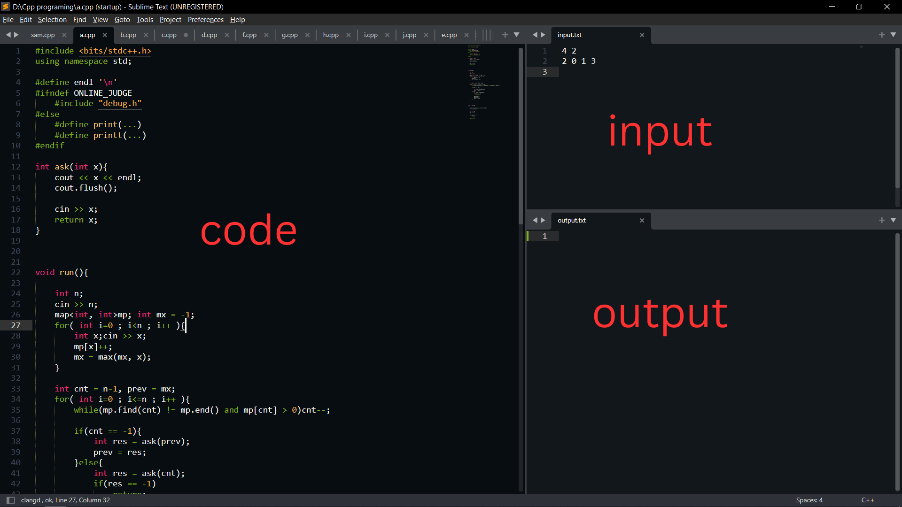

# A Posh Sublime Setup in Ubuntu

Here is a posh Sublime setup for Ubuntu that includes the following features:
1. Build system with timeout and memory limit
1. Build system to run program in the terminal
1. Problem parser 
1. Linter
1. Good suggestions similar to VS Code.

### Sublime Installation 
First, we need to install Sublime. You can download it from the Ubuntu Software Center.

Alternatively, you can use the following commands to install Sublime:
```
wget -qO - https://download.sublimetext.com/sublimehq-pub.gpg | gpg --dearmor | sudo tee /etc/apt/trusted.gpg.d/sublimehq-archive.gpg > /dev/null
echo "deb https://download.sublimetext.com/ apt/stable/" | sudo tee /etc/apt/sources.list.d/sublime-text.list

sudo apt update
sudo apt install sublime-text
```

### gcc Installation
If you don't have the C++ compiler installed, then open the terminal and type the following command to install it.
```
sudo apt install gcc g++
```

# Procedures    
      
     
## 1. Making build system with time and memory limit
- Open Sublime and create a view for three files.

Go to `View -> Layout -> Columns: 2`. Then, with the cursor in the right column, go to `View -> Groups -> New Group`

- Now open your c++ file and create 2 files named `input.txt` and `output.txt` in the same directory as you c++ file. Your code will take input from the `input.txt` file and write output to `output.txt`.

- Now create a new build system by selecting `Tools -> Build Systems -> New Build System`. Copy the contents of the file [CppIO.sublime-build](CppIO.sublime-build) and paste it into the build system you created and save it.  
    >  Note : Make sure you are saving the build system in the sublime's package file.  Make sure the name of the build system ends with .sublime-build, for example `CppIO.sublime-build`.

- Now select the automatic build system by going `Tools -> Build System -> Automatic`. Press `ctrl + shift + b`. And select the build system you created(for example: `CppIO` ). Now press `ctrl + b` and the code will run.    
        
       
       
## 2. Setting up Terminus for terminal based build system

- Install `Terminus` package for accessing terminal in sublime. Press `ctrl + shift + p` and type "install" and choose "install package", then type `Terminus` and chose terminus and press enter. 

- Create a build system to run programs in terminal. Copy the contents of the file [Cpp Terminal.sublime-build](https://github.com/Sami-63/Sublime-setup/blob/master/Cpp%20Terminal.sublime-build). Now go to `Tools -> Build Systems -> New Build System` and paste and save the build system. 
    >  Note : Make sure you are saving the build system in the sublime's package file.  Make sure the name of the build system ends with .sublime-build, for example `Cpp Terminal.sublime-build`.

- To run the terminal build system press `ctrl + shift + b` and select the terminal build system(for example: `Cpp Terminal`).
    
   
## 3. Setting up problem parser

- Now its time to setup the problem parser. Press `ctrl + shift + p` and type install and choose "install package" and wait. Once the packages loaded type "cppfastolympiccoding" and chose `CppFastOlympicCoding` and wait for it to install. Once its instelled press `ctrl + alt + b` and it will pop up an window at the right runing the current code. 

    > Note : If `install package` option is not available, there might be an option called `Install package control`, select that, and    after some time you would get the message "installed package control" after that you can install package. 

-  Now go to `Preferences -> Browse Package` . Open a terminal on that folder and run this command. This is a repo of [DrSwad](https://github.com/DrSwad) 
    ```
    git clone https://github.com/DrSwad/FastOlympicCodingHook.git
    ```
    > Note : if you don't have git, install it using this command 
     ```
     sudo apt install git
     ```
- Now open up your browser and install an extension called `Competitive Companion`.   
a. If you are using chrome when you go to the options of the extension, a popup box will occur before you asking for the port. Type `12345` and close the popup box.  
b. If you are using firefox, then go the the settings of the extension. Then in the preferences menu set the port to `12345`

- Now when you right click on a file in subilme you will see an option called `Listen to competitive companion`. Now we'll change the run key bindings and make some optimization. First go to `Preferences -> Browse Package -> CppFastOlympicCoding` then open `Default (Linux).sublime-keymap`. Using `ctrl + f` find `ctrl + alt + b` and change it to `ctrl + ;`. Threre will be 2 occurences. Change both of them.

- Copy all the content in the [Default (Linux).sublime-keymap](https://github.com/Sami-63/Sublime-setup/blob/master/Default%20(Linux).sublime-keymap) and go to `Preferences -> Key bindings`. In the right panel paste everything you copied. 

- Press `ctrl + shift + p` and type `setting` and go to `cppfastopympiccoding setting`. In the left panel, in "run_settings", in compile_cmd change the `-std=c++11` to `-std=c++17`, and in the lint_compile_cmd change the `-std=gnu++11` to `-std=gnu++17`. And you are set to go. 

- The procedure to get problem test case is -  
    a. Press `Ctrl + h`  
    b. Then go the problem page and click on the competitive companion icon.   
    c. When the blue line goes from left to right, then the test cases will be fetched from the page to sublime. Now go to sublime and press `ctrl + ;`. 

   
## 4. Setting up Linter  

- Problem parser is done, now lets setup the linter and auto suggestion. We need to install 2 packages, `SublimeLinter`, `SublimeLinter-gcc` for linter. Press `ctrl + shift + p` and type "install" and choose install package and install these packages one by one. 

- Copy all the content from [SublimeLinter.sublime-settings](https://github.com/Sami-63/Sublime-setup/blob/master/SublimeLinter.sublime-settings). Now press `ctrl + shift + p` and type "Settings" and choose "SublimeLinter - Settings" and in the right panel paste everything you copied.
   

## 5. Setting up auto suggestion

- For auto suggestion install package called `LSP`. Press `ctrl + shift + p` and type "install" and choose "install package" and install the package. 

- Now open terminal and install clangd
    ```
    sudo apt install clangd
    ```

- Now go to sublime and type `ctrl + shift + p` and type setting and go to "LSP - Settings". Now copy all the content from [LSP.sublime-settings](https://github.com/Sami-63/Sublime-setup/blob/master/LSP.sublime-settings) and paste in the LSP setings file. 

- Now the auto suggestion and linter both will work. 
